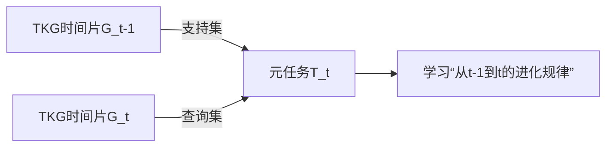
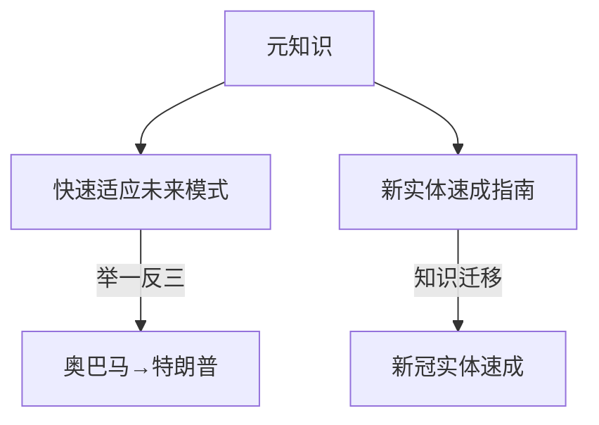
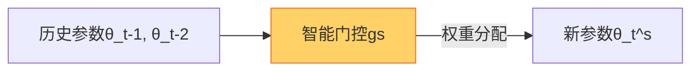

### 0.1.1 🎯 ​**​一、痛点暴击：传统模型为啥翻车？​**​

> “历史学得好，未来一定灵？”——NO！看论文图1大型打脸现场👇

​**​致命伤1️⃣：进化模式变变变！​**​

> 新冠爆发前训练的模型，疫情后直接GG——事实演化模式说变就变，旧模型秒变“老古董”。

​**​致命伤2️⃣：新实体冷启动难！​**​

> 未来实体中​**​70%都是历史记录不足50条的萌新​**​（图1b），传统模型：“没历史？不会学！”

---

### 0.1.2 🚀 ​**​二、核心理念：向“时间”偷师学艺！​**​

> ​**​核心创新点​**​：把整个TKG拆成​**​时间碎片任务流​**​，用​**​元学习​**​榨取“进化规律”的精华！

#### 0.1.2.1 🔮 ​**​学术裁缝灵感点1：时间元任务设计​**​

> ​**​裁缝指南​**​：相邻时间片组成任务（G_t-1当课本，G_t当随堂考），让模型在​**​时间流里做任务闯关​**​！

#### 0.1.2.2 🧠 ​**​学术裁缝灵感点2：双重进化元知识​**​

> ​**​黑科技解释​**​：像人类“掌握学习方法后学啥都快”，模型get​**​进化元知识​**​后——
> 
> ✅ 面对新演化模式（如疫情突发）​**​秒适应​**​
> 
> ✅ 新实体用​**​历史学霸经验包​**​速成！

---

### 0.1.3 🛠️ ​**​三、核心组件：时空门控黑科技​**​

> ​**​创新点MVP​**​：​**​门控整合模块（Gating Integration）​**​ ——让任务间偷偷“传纸条”！

#### 0.1.3.1 ⚡ ​**​学术裁缝高光点：组件定制化门控​**​

> ​**​裁缝指南​**​：
> 
> - ​**​门控公式​**​：$θ_t^s = σ(g_s)⊙θ_t-1 + (1-σ(g_s))⊙θ_t-2$
>     
> - ​**​灵魂操作​**​：实体嵌入、关系嵌入、普通参数​**​分！开！调！​**​（组件特定门控）
>     
> - ​**​为什么香​**​：实体嵌入更新少→门控保守；关系嵌入更新多→门控激进！（妥妥的定制化学习方案）
>     

---

### 0.1.4 📊 ​**​四、实验结果：屠榜现场直击​**​

> ​**​暴力结论​**​：插上MetaTKG，三大模型（RE-NET/RE-GCN/CEN）直接起飞🛫️

|模型|ICEWS14-MRR提升|ICEWS05-15-MRR提升|新实体预测涨幅|
|---|---|---|---|
|RE-NET|+5.47%🚀|+11.57%💥|+8.2%|
|RE-GCN|+3.46%|+6.63%|+7.5%|
|CEN|+2.44%|+7.73%|+8.6%|

> ​**​重点看这里​**​：
> 
> 1️⃣ ​**​时间越长越牛逼​**​（图3）👉 后期预测涨幅吊打前期
> 
> 2️⃣ ​**​新实体拯救者​**​（图4）👉 历史不足50条的实体性能​**​暴涨8%+​**​

---

### 0.1.5 💡 ​**​五、裁缝宝典：可复用的学术骚操作​**​

1. ​**​元任务流水线​**​：任何时序场景（推荐/金融预测）都可拆成​**​相邻时间任务链​**​
    
2. ​**​门控知识快递​**​：用​**​组件定制门控​**​解决多频更新参数混合问题（实体vs关系vs通用参数）
    
3. ​**​冷启动杀手锏​**​：​**​元知识迁移​**​套路直接抄！新用户/新商品冷启动都能照搬
    

---

### 0.1.6 💎 ​**​一句话收尾​**​

> “​**​不要死学历史，要偷师进化！​**​”
> 
> MetaTKG：把时间变成你的作弊器，让模型学会“学习的方法”——
> 
> 这才是时序推理的终极浪漫啊！✨