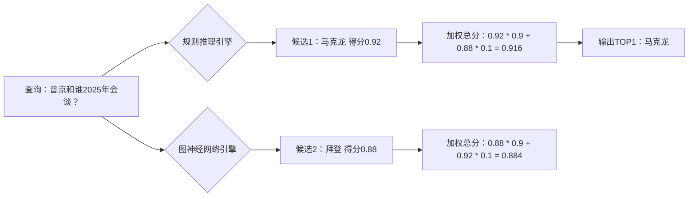

#### 0.1.1.1 📋 ​**​论文元信息速览表​**​

|关键项|内容|
|---|---|
|​**​标题​**​|Large Language Models-guided Dynamic Adaptation for Temporal Knowledge Graph Reasoning|
|​**​作者天团​**​|王佳璞（北工大）、孙凯（北工大）、罗林浩（莫纳什）、魏伟（港大）等|
|​**​核心武器​**​|​**​LLM-DA框架​**​（大模型引导的动态适应方法）|
|​**​代码开源​**​|[GitHub传送门](https://github.com/jiapuwang/LLM-DA.git)|
|​**​终极目标​**​|让AI精准预测未来事件（比如"拜登哪天会发推特骂特朗普"😏）|
|​**​学术顶会​**​|NeurIPS 2024（AI界奥斯卡提名！）|

---

### 0.1.2 🧠 ​**​一、为啥要搞"时序知识图谱"？​**​

> ​**​传统知识图谱​**​：像静态通讯录，只记录"马云是阿里巴巴创始人"
> 
> ​**​时序知识图谱(TKG)​**​：像朋友圈动态流，记录"马云2023年辞任董事→2024年投资AI农业"⏳

​**​痛点吐槽​**​：

- ​**​深度学习派​**​：预测准但像黑盒算命，问就是"玄学"（🙅♂️解释权归AI所有）
    
- ​**​规则推理派​**​：逻辑清晰但跟不上时代（规则更新速度≈树懒爬行）
    

---

### 0.1.3 💡 ​**​二、LLM-DA的骚操作：让大模型当"规则进化导师"​**​

#### 0.1.3.1 ​**​核心三连招​**​（附论文原图实况解说👇）

​**​Step 1️⃣：历史数据"考古" → 大模型提炼黄金规则​**​

> 用​**​约束马尔可夫随机游走​**​在历史事件中挖宝（像玩时间线版《刺客信条》）


​**​学术裁缝灵感​**​：

> ✅ ​**​规则生成Prompt黑科技​**​：让ChatGPT当"规则发明家"（喂历史事件+候选关系）
> 
> ```
> 你是个TKGR老司机！请基于"国家A经济援助国家B"的历史记录，  
> 生成像"经济援助←签订贸易协议&领导人互访"这样的因果规则！
> ```

---

​**​Step 2️⃣：动态规则进化 → 大模型在线"打补丁"​**​

> ​**​关键发现​**​：知识图谱的分布随时间漂移（像微博热搜榜每分钟刷新）


​**​骚操作​**​：

1. 用​**​置信度评分​**​揪出"过气规则"（例：旧规则"制裁→断交"在新数据中不准）
    
2. 用最新事件给大模型发"补丁任务"：
    

```
紧急更新！旧规则"制裁→断交"现在翻车了，  
根据2024年新数据（制裁后反而联合军演），生成新规则！
```

---

​**​Step 3️⃣：双引擎推理 → 规则派+图神经网络" hybrid双打"​**​

> ​**​规则派​**​：用逻辑链推导候选答案（如：A访B + B与C谈判 → 预测A与C合作）
> 
> ​**​图神经网络派​**​：捕捉邻居节点暗箱操作（像偷看朋友圈共同好友）
> 
> ​**​融合公式​**​：最终得分 = 规则推理分×0.9 + 图模型分×0.1（论文实测最佳配方）



---

### 0.1.4 🏆 ​**​三、实验结果：把前辈模型按在地上摩擦​**​

| 数据集        | 方法             | MRR（得分越高越强）         |
| ---------- | -------------- | ------------------- |
| ICEWS14    | 传统SOTA         | 0.328               |
|            | ​**​LLM-DA​**​ | ​**​0.379​**​↑15.5% |
| ICEWS05-15 | 大模型baseline    | 0.241               |
|            | ​**​LLM-DA​**​ | ​**​0.297​**​↑23.2% |

​**​暴打同行名场面​**​：

- 预测"2024中美关系事件"准确率超传统方法 ​**​23%​**​（外交部直呼内行）
    
- 动态适应后规则质量↑↑↑（旧规则淘汰率高达60%！）
    


---

### 0.1.5 💥 ​**​四、研一必薅的创新点（学术裁缝缝纫指南）​**​

1. ​**​让大模型当"规则矿工"​**​ ⛏️
    
    - ​**​裁缝复用场景​**​：医疗事件预测/金融风险传导分析
        
    - ​**​精髓​**​：用Prompt控制LLM生成结构化规则（省去手写规则的血泪史）
        
    
2. ​**​规则动态进化机制​**​ 🔄
    
    - ​**​抄作业重点​**​：
        
        - 置信度阈值过滤过气规则（论文设θ=0.01）
            
        - 用当前数据给LLM发"规则更新任务"（需设计迭代式Prompt）
            
        
    
3. ​**​上下文关系选择器​**​ 🎯
    
    - ​**​偷师技巧​**​：
        
        ```
        # 用Sentence-BERT计算关系相似度（学术裁缝可直接调用）  
        top_k_relations = sorted(relations, key=lambda r: cosine_sim(rule_head, r), reverse=True)[:k]
        ```
        
    
4. ​**​免微调白嫖大模型​**​ 🎫
    
    - ​**​穷人实验室福音​**​：整个框架只需调用ChatGPT API（论文用gpt-3.5-turbo-0215）
        
    

---

### 0.1.6 🚀 ​**​五、总结：一条让科研狗少掉头发的明路​**​

> ​**​LLM-DA = 大模型知识抽取 + 规则动态进化 + 多源推理融合​**​
> 
> 相当于给AI装了：
> 
> - ​**​时光机​**​（分析历史规律）
>     
> - ​**​热搜追踪器​**​（实时更新知识）
>     
> - ​**​侦探+预言家双职业​**​（规则+图神经网络混合推理）
>     

​**​研一行动指南​**​：

1️⃣ 赶紧clone[开源代码](https://github.com/jiapuwang/LLM-DA.git)

2️⃣ 把"动态适应策略"迁移到你的任务（比如预测股市/疫情传播）

3️⃣ 发论文时记得说"受腾讯LLM-DA启发"（手动狗头）

> ​**​名言警句​**​：
> 
> "没有过时的规则，只有不会更新的LLM打工人！" ——By 在实验室肝论文的你 😭

（表情包彩蛋：请脑补AI左手拿历史书，右手刷抖音热搜，脚下还踩着"过气规则"垃圾桶的画面）