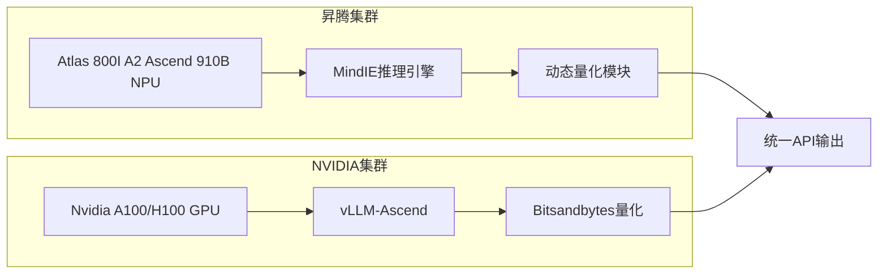

# 1 DeepSeek-R1-671B 模型部署方案

## 1.1 一、模型概述🌟​

DeepSeek-R1-671B 是一款基于 Transformer 架构的大型语言模型，具有 671 亿参数，支持多种自然语言处理任务，如文本生成、问答、摘要等。该模型有两种常见且优秀的版本：**满血版（BF16）和量化版（W8A8）**。满血版模型精度高，但对硬件资源要求较高；量化版模型通过权重量化技术，在保持一定精度的同时，降低了模型的存储和计算需求，更适合资源受限的场景。

## 1.2 二、部署方案

### 1.2.1 方案一：华为昇腾环境部署🐉

#### 1.2.1.1 硬件要求

| 组件    | 满血版（BF16）              | 量化版（W8A8）              |
| ----- | ---------------------- | ---------------------- |
| 服务器类型 | Atlas 800I A2（8×64G）×4 | Atlas 800I A2（8×64G）×2 |
| CPU   | 4路48核                  | 4路48核                  |
| 内存    | 1536GB                 | 1536GB                 |
| GPU   | 昇腾 910B（64GB）×32       | 昇腾 910B（64GB）×16       |
| 网络带宽  | 100Gbps                | 100Gbps                |
| 存储    | NVMe SSD，容量≥1.3TB      | NVMe SSD，容量≥2TB        |

#### 1.2.1.2 软件要求

| 组件             | 版本                                              |
| -------------- | ----------------------------------------------- |
| MindIE推理框架     | 2.0.T3.1-800I-A2-py311-openeuler24.03-lts       |
| CANN工具包        | 8.0.T63                                         |
| PTA            | 6.0.T700                                        |
| MindStudio量化工具 | Msit: br_noncom_MindStudio_8.0.0_POC_20251231分支 |
| HDK            | 24.1.0                                          |
| Python         | 3.11                                            |

#### 1.2.1.3 部署流程

1. **模型权重准备**
   - 从 HuggingFace、ModelScope 或魔乐社区下载 DeepSeek-R1-671B 模型权重。
   - 对于满血版，下载 BF16 格式的权重；对于量化版，下载 W8A8 格式的权重。
   - 将权重文件放置在指定路径，并确保权重文件夹权限为 750。

2. **容器化部署**
   - 使用昇腾官方提供的 Docker 镜像，如 `mindie:2.0.T3.1-800I-A2-py311-openeuler24.03-lts`。
   - 启动容器时，挂载模型权重路径和配置文件路径。
   - 进入容器后，配置基础环境变量和通信环境变量，如 `Ascend`、`ATB_LLM_HCCL_ENABLE`、`HCCL_CONNECT_TIMEOUT` 等。

3. **服务化配置**
   - 修改 `config.json` 文件，配置模型权重路径、端口号、多机推理等参数。
   - 启动服务化接口，使用 `mindieservice_daemon` 命令拉起服务。

4. **测试与验证**
   - 使用 `curl` 命令发送请求，验证模型服务是否正常运行。
   - 进行性能测试，调整参数以优化模型性能。

### 1.2.2 方案二：Nvidia GPU 环境部署💻

#### 1.2.2.1 硬件要求

| 组件    | 满血版（BF16）            | 量化版（W8A8）            |
| ----- | -------------------- | -------------------- |
| 服务器类型 | DGX A100（8×80GB）×4   | DGX A100（8×80GB）×2   |
| CPU   | 4路48核                | 4路48核                |
| 内存    | 1TB                  | 1TB                  |
| GPU   | Nvidia A100（80GB）×32 | Nvidia A100（80GB）×16 |
| 网络带宽  | 100Gbps              | 100Gbps              |
| 存储    | NVMe SSD，容量≥2TB      | NVMe SSD，容量≥2TB      |

#### 1.2.2.2 软件要求

| 组件       | 版本    |
| -------- | ----- |
| CUDA工具包  | 12.4  |
| cuDNN    | 8.9   |
| PyTorch  | 2.3.0 |
| vLLM推理引擎 | 0.7.3 |
| Python   | 3.11  |

#### 1.2.2.3 部署流程

1. **环境准备**
   - 安装 CUDA 和 cuDNN。
   - 安装 PyTorch 和 Transformers 库。
   - 安装 vLLM 插件，用于加速模型推理。

2. **模型权重准备**
   - 从 Hugging Face 、ModelScope或魔乐社区下载 DeepSeek-R1-671B 模型权重。
   - 对于满血版，使用 BF16 格式的权重；对于量化版，使用 W8A8 格式的权重。
   - 将权重文件放置在指定路径，并确保权重文件夹权限为 750。

3. **配置分布式推理**
   - 根据vllm的部署文档，配置多机多卡运行参数，通过脚本进行分布式推理。

4. **测试与性能调优**
   - 使用chatbox、cherry studio或open-web-ui等进行测试。
   - 监控系统资源使用情况，优化 GPU 和 CPU 的利用率。

## 1.3 三、方案对比📊

| 对比维度            | 昇腾方案                | Nvidia方案               |
| --------------- | ------------------- | ---------------------- |
| ​**硬件成本**​      | 高（专用服务器集群）          | 极高（H100单卡约$30,000）     |
| ​**部署复杂度**​     | 复杂（需配置NPU网络与算子适配）   | 中等（依赖成熟生态工具链）          |
| ​**国产化支持**​     | ✅ 全链路自主可控           | ❌ 依赖进口硬件               |
| ​**量化支持**​      | W8A8需手动转换           | 原生支持FP8/W8A8（TensorRT） |
| ​**性能（BF16）​**​ | 约1911 tokens/s（4节点） | 约3200 tokens/s（8×A100） |

## 1.4 四、总结

选择部署方案时，需要综合考虑硬件成本、软件生态、部署复杂度、性能优化和社区支持等因素。华为昇腾环境适合对数据安全和自主可控要求较高的场景，而 Nvidia GPU 环境则适合对性能和成本敏感的场景。无论选择哪种方案，都需要根据实际需求进行性能测试和优化，以确保模型服务的稳定性和高效性。
