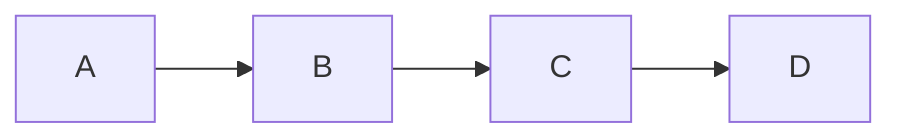
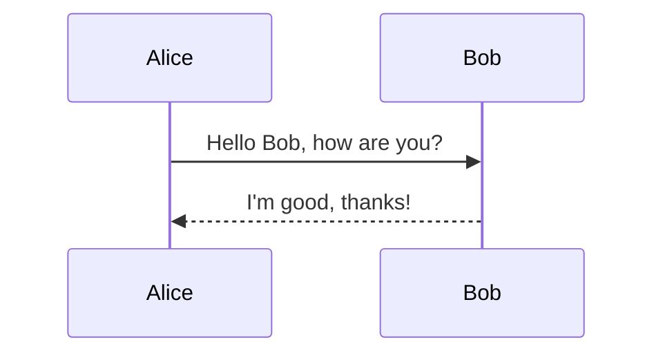
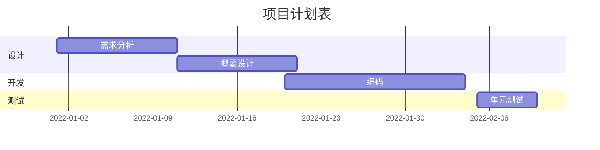
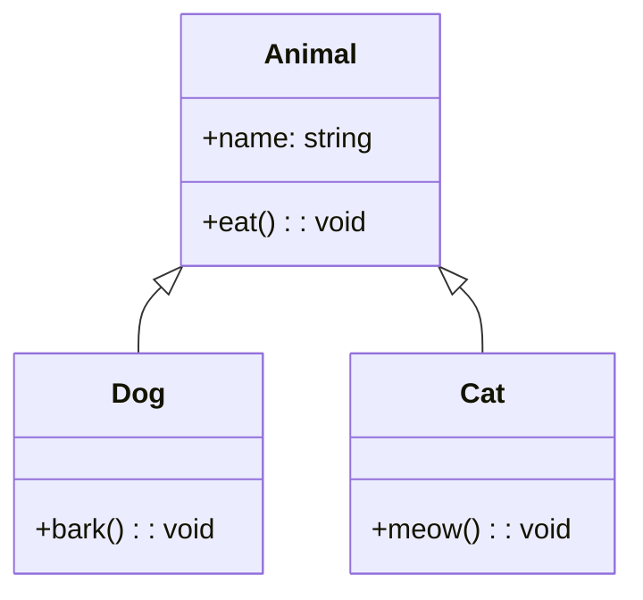

mermaid语法教程

 Mermaid是一种用于生成流程图、时序图、甘特图和类似图表的文本描述语法。它采用简洁的语法，使得用户可以轻松地用文本编辑器创建复杂的图表。

以下是一些常用的Mermaid语法示例：

1. 流程图：

这段代码将生成一个简单的流程图，其中A连接到B，B连接到C，C连接到D。

2. 时序图：

这段代码将生成一个简单的时序图，其中Alice发送消息给Bob并收到回复。

3. 甘特图：

这段代码将生成一个简单的甘特图，其中包含了项目计划表中的设计、开发和测试阶段。

4. 类似图表：

这段代码将生成一个简单的类似图表，其中包含了Animal、Dog和Cat类以及它们之间的继承关系。
